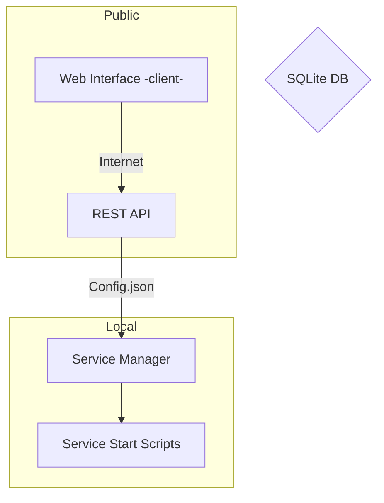

# VPS-Service-Manager

|Part|Language|
|:---|:-------|
|**Web Interface**|HTML/CSS/JS(NGINX)|
|**REST API**|TypeScript(Express)|
|**Service Manager**|Python|
|**Service Start Scripts**|Bash|

## (Work-In-Progress) graph of how it kinda works

